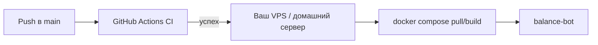

# CI/CD на GitHub

В репозитории настроена автоматическая проверка кода и сборка Docker-образа. Развёртывание бота на сервер выполняется вручную или отдельным deploy-workflow — секреты (`config.yaml`) в git не попадают.

## CI — что запускается автоматически

Workflow: [`.github/workflows/ci.yml`](../.github/workflows/ci.yml) (actions на Node.js 24: `checkout@v6`, `setup-uv@v7`, `setup-buildx-action@v4`, `build-push-action@v7`)

| Событие | Ветки |
|---------|--------|
| `push` | `main` |
| `pull_request` | в `main` |

### Job `check` (Python)

1. `uv sync --frozen` — зависимости по `uv.lock`
2. `compileall` — синтаксис `balance_bot/` и `plugins/`
3. Загрузка всех плагинов из `plugins/`, валидация [`config.ci.yaml`](../config.ci.yaml) (mock, без реальных токенов)
4. `balance-bot --help` — проверка CLI

### Job `docker`

После успешного `check` собирается Docker-образ (без push в registry).

### Локально повторить CI

```bash
uv sync --frozen
uv run python -m compileall -q balance_bot plugins
uv run python -c "
from pathlib import Path
from balance_bot.config import load_config
from balance_bot.plugins.loader import ensure_plugins_for_services, init_plugins, registered_plugins
init_plugins(Path('plugins').resolve())
cfg = load_config('config.ci.yaml')
ensure_plugins_for_services(cfg.services)
print(registered_plugins())
"
docker build -t balance-bot:local .
```

## CD — развёртывание на сервер

Бот — long-running сервис с локальным `config.yaml`. Типичная схема:



### 1. Подготовка сервера (один раз)

- Docker и Docker Compose v2
- Клон репозитория или только каталог с `docker-compose.yml`, `config.yaml`, `plugins/`
- Файл `config.yaml` **только на сервере**, в `.gitignore`

```bash
git clone https://github.com/<ORG>/<REPO>.git balance_bot
cd balance_bot
cp config.example.yaml config.yaml
# отредактируйте config.yaml
```

### 2. Обновление после изменений в main

На сервере в каталоге проекта:

```bash
git pull
docker compose build --pull
docker compose up -d
docker compose logs -f --tail=50 balance-bot
```

Только перезапуск без пересборки (если меняли только `config.yaml` или плагины):

```bash
docker compose restart balance-bot
```

### 3. Секреты в GitHub (опционально)

Если позже добавите deploy через Actions, создайте **Repository secrets** (Settings → Secrets and variables → Actions):

| Secret | Назначение |
|--------|------------|
| `SSH_HOST` | IP или hostname сервера |
| `SSH_USER` | пользователь SSH |
| `SSH_KEY` | приватный ключ (ed25519) |
| `DEPLOY_PATH` | путь к проекту на сервере, например `/opt/balance_bot` |

`config.yaml` на сервер **не копируйте из CI** — храните только на машине с ботом.

### 4. Пример deploy-workflow (опционально)

Создайте `.github/workflows/deploy.yml` при необходимости автодеплоя по push в `main`:

```yaml
name: Deploy

on:
  workflow_dispatch:
  push:
    branches: [main]

jobs:
  deploy:
    runs-on: ubuntu-latest
    if: github.repository == 'ORG/REPO'  # замените на свой репозиторий
    steps:
      - uses: actions/checkout@v6

      - name: Deploy over SSH
        uses: appleboy/ssh-action@v1
        with:
          host: ${{ secrets.SSH_HOST }}
          username: ${{ secrets.SSH_USER }}
          key: ${{ secrets.SSH_KEY }}
          script: |
            set -e
            cd ${{ secrets.DEPLOY_PATH }}
            git pull
            docker compose build
            docker compose up -d
            docker compose ps
```

Рекомендации:

- включайте deploy только после зелёного CI (отдельный workflow или `workflow_run`);
- ограничьте `workflow_dispatch` для продакшена;
- на сервере `config.yaml` уже должен существовать до первого деплоя.

### 5. Публикация образа в GHCR (опционально)

Если хотите тянуть готовый образ вместо `build` на сервере:

1. Включите GitHub Packages для репозитория.
2. Добавьте workflow с `push: true` в `docker/build-push-action` и тегом `ghcr.io/<org>/balance-bot:latest`.
3. На сервере в `docker-compose.yml` замените `build: .` на `image: ghcr.io/<org>/balance-bot:latest` и выполните `docker compose pull`.

## Статус проверок в README

После первого push подставьте свой репозиторий в бейдж:

```markdown
[](https://github.com/<ORG>/<REPO>/actions/workflows/ci.yml)
```

## Частые проблемы CI

| Симптом | Что сделать |
|---------|-------------|
| `uv sync` падает | обновите `uv.lock` локально: `uv lock` и закоммитьте |
| нет плагина в `registered_plugins` | проверьте `PLUGIN_NAME` / имя файла в `plugins/` |
| Docker build failed | воспроизведите локально: `docker build .` |
| валидация `config.ci.yaml` | не используйте плейсхолдеры токена вроде `YOUR_BOT_TOKEN` — в CI нужен формат `123456789:...` |
