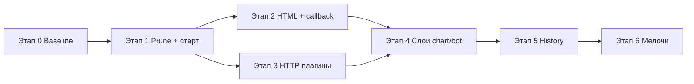

# План рефакторинга balance_bot

Документ основан на повторном архитектурном обзоре (после истории, `/chart`, `poll_errors`, `http_errors`).
Цель — улучшить производительность, сопровождаемость и устойчивость без смены внешнего поведения бота.

**Ограничения:** личный/малый деплой (4–10 сервисов, один инстанс), плагины через volume, SQLite на диске.

---

## Принципы

1. **Малые PR** — один этап = один mergeable changeset с тестами.
2. **Поведение не ломаем** — после каждого этапа `pytest` зелёный, ручная проверка `/status`, `/refresh`, `/chart`.
3. **Сначала дешёвые победы** — производительность и баги старта, потом структура.
4. **Плагины не трогаем массово**, пока нет общего HTTP-слоя (этап 3).

---

## Этап 0 — Baseline (перед любыми изменениями)

| Задача | Критерий готовности |
|--------|---------------------|
| Зафиксировать текущие метрики | Время старта контейнера, число HTTP-запросов при boot, размер `balance_bot.db` |
| Прогнать тесты | `pytest` — 100% pass |
| Smoke в Telegram | `/status`, `/refresh`, `/chart` на 2+ сервисах |

**Оценка:** 30 мин.

---

## Этап 1 — Производительность истории и опроса (высокий приоритет) ✅

*Реализовано в коммите после 0.3: `prune_interval_hours`, prune после `poll_all_now`, фоновый prune, `delay_first` при старте, per-service poll lock.*

Проблемы: `prune()` после каждой записи; двойной опрос при старте; гонка `/refresh` с фоновыми poller'ами.

### 1.1. Вынести `prune` из hot path

**Сейчас:** `scheduler._persist_history()` → `record()` + `prune()` на каждый `poll_once`.

**Сделать:**

- Вызывать `prune()`:
  - при старте бота (как сейчас в `app.run`);
  - по таймеру (например, раз в 6–24 ч, конфиг `history.prune_interval_hours`, default `24`);
  - опционально после `poll_all_now()` (один раз на batch, не N раз).
- Убрать `prune()` из `_persist_history`.

**Файлы:** `balance_bot/scheduler.py`, `balance_bot/app.py`, `balance_bot/models.py`, `balance_bot/config.py`, `balance_bot/validation.py`, `tests/test_scheduler.py`, `tests/test_history.py`.

**Критерий:** при 4 сервисах и одном цикле опроса — один `prune` за интервал, не 4.

### 1.2. Убрать двойной опрос при старте

**Сейчас:** `scheduler.start_all()` (сразу `poll_once` в `_loop`) + `await poll_all_now()`.

**Варианты (выбрать один):**

- **A (рекомендуется):** `start_all(delay_first=True)` — первый `poll_once` только после `sleep(interval)`, а начальный снимок — один `poll_all_now()` до `start_polling`.
- **B:** убрать `poll_all_now()` при старте, оставить только `_loop` (медленнее первый `/status`).

**Файлы:** `balance_bot/app.py`, `balance_bot/scheduler.py`, `tests/test_scheduler.py`.

**Критерий:** в логах при старте — ровно один успешный опрос на сервис до `Start polling`.

### 1.3. Сериализация `/refresh` (опционально в этом этапе)

**Сейчас:** `poll_all_now()` может пересечься с фоновым `poll_once`.

**Сделать:** `asyncio.Lock` на уровне `Scheduler` вокруг `poll_once` / `poll_all_now` (не блокировать long polling).

**Критерий:** параллельный `/refresh` и фоновый tick не дают двойных записей с разницей < 1 с для одного сервиса.

**Оценка этапа 1:** 1–2 дня.

---

## Этап 2 — Безопасность сообщений Telegram (средний приоритет) ✅

*Реализовано: `escape_html` в уведомлениях и подписи графика; callback `/chart` по индексу сервиса; валидация длины `name` ≤ 64.*

Проблема: `notifications.py` вставляет `service_name` и `status.error` в HTML без экранирования. `http_errors` закрыл HTML от 504, но не все источники ошибок.

### 2.1. Минимальное экранирование

**Сделать:**

- `html.escape(text, quote=False)` для: `service_name`, `status.error`, `alert` (unknown type).
- Не трогать числа, даты, валюту (там нет разметки).

**Файлы:** `balance_bot/notifications.py`, `tests/test_notifications.py`.

**Критерий:** ошибка вида `<b>test</b>` и имя сервиса `a<b` не ломают `ParseMode.HTML`.

### 2.2. Callback data для `/chart`

**Сделать:**

- Валидация длины `callback_data` ≤ 64 байт (укоротить имя в кнопке или mapping index → name в памяти dispatcher).
- Документировать ограничение на `service.name` (без `:`, длина).

**Файлы:** `balance_bot/charts.py`, `balance_bot/bot.py`, `balance_bot/validation.py` (опционально), README.

**Оценка этапа 2:** 0.5–1 день.

---

## Этап 3 — Общий HTTP-слой плагинов (средний приоритет, высокая отдача) ✅

*Реализовано: `plugins/http_client.py` (`PluginHttpClient`, `PluginApiError`, утилиты); миграция vdsina → aeza → cloud; удалён `aeza._unwrap_account`.*

Проблема: `aeza`, `cloud`, `vdsina` дублируют ~200 строк (session, errors, `_to_float`, `_parse_datetime`, trace_id).

### 3.1. `plugins/http_client.py` (или `balance_bot/plugin_http.py`)

**Вынести:**

- lazy `ClientSession`, `close()`;
- `request_json(method, url, ...)` с `format_http_error_body`, логированием ERROR, `*ApiError` базовым классом;
- общие утилиты: `to_float`, `parse_datetime`, `extract_trace_id`, `api_message`.

### 3.2. Постепенная миграция плагинов

Порядок: `vdsina` (простейший) → `aeza` → `cloud` (IAM отдельно).

**Критерий:** `test_plugins_http.py` без изменения контрактов; дифф плагинов — только вызовы хелпера.

### 3.3. Удалить мёртвый код

- `aeza._unwrap_account()` — удалить, если после миграции не используется.

**Оценка этапа 3:** 2–3 дня.

---

## Этап 4 — Разделение слоёв бота и графиков (низкий приоритет)

Проблема: `charts.py` смешивает matplotlib, агрегацию и Telegram-клавиатуры; `create_dispatcher` — god-function.

### 4.1. Разделить `charts`

| Модуль | Ответственность |
|--------|-----------------|
| `balance_bot/chart_data.py` | `aggregate_points_for_chart`, `BalancePoint` pipeline, периоды |
| `balance_bot/chart_render.py` | matplotlib → PNG (lazy import внутри функции) |
| `balance_bot/chart_ui.py` | клавиатуры, parse callback, константы `chart:s:` / `chart:p:` |

`bot.py` импортирует только `chart_ui` + `render_balance_chart`.

### 4.2. Упростить `create_dispatcher`

- Вынести handlers в `balance_bot/handlers/` (`status.py`, `chart.py`, `refresh.py`) или функции верхнего уровня в `bot_handlers.py`.
- Общая `send_chart_photo(message, png, caption)`.

### 4.3. Lazy import matplotlib

Перенести `import matplotlib` в `_render_chart_sync` / `chart_render.py` — ускорить старт без `/chart`.

**Оценка этапа 4:** 2 дня.

---

## Этап 5 — HistoryStore и конфиг (низкий приоритет)

Проблема: `HistoryStore` — god-class; `fetch_series` + `count_poll_errors` — два round-trip; `period=all` без лимита.

### 5.1. Объединить запросы для графика

Один метод `fetch_chart_data(service, since) -> (points, error_count)`.

### 5.2. Лимит на `period=all`

Конфиг `history.chart_max_points` (например, 10_000) или жёсткий cap в `fetch_series`.

### 5.3. (Опционально) Разделить классы

- `HistoryWriter` — record, migrate;
- `HistoryReader` — fetch_series;
- `HistoryRetention` — prune.

Только если этап 1–4 завершены и нужна дальнейшая работа с историей (экспорт, `/history`).

**Оценка этапа 5:** 1–2 дня.

---

## Этап 6 — Мелочи и чистка (по желанию)

| Задача | Файлы |
|--------|-------|
| Убрать двойной `setup_logging` в `main()` | `app.py` |
| `ConfigError` → `balance_bot/exceptions.py` | `validation.py`, `config.py`, `loader.py` |
| `PruneStats` — использовать в логах или упростить API | `history.py`, `scheduler.py` |
| VDSina: `asyncio.gather` для двух GET | `plugins/vdsina.py` |
| Убрать неиспользуемый `cfg` в `cloud._get_json` | `plugins/cloud.py` |
| Документировать trust boundary для `plugins/` volume | `README.md`, `docs/plugins/README.md` |

**Оценка:** 0.5–1 день.

---

## Что сознательно не делаем (вне scope)

| Идея | Почему |
|------|--------|
| Несколько инстансов бота | Нет требования; нужен Redis/общая БД |
| ORM / aiosqlite | stdlib + `to_thread` достаточно |
| Plugin config schema в ядре | Высокая стоимость; плагины валидируют сами |
| Rate limit `/refresh` | Один доверенный пользователь |
| Grafana / внешний дашборд | Уже есть `/chart` |

---

## Порядок выполнения (roadmap)

**Рекомендуемая очередь PR:**

1. `refactor/prune-schedule` — этап 1.1  
2. `refactor/startup-single-poll` — этап 1.2  
3. `refactor/refresh-lock` — этап 1.3  
4. `fix/notifications-html-escape` — этап 2.1  
5. `refactor/plugin-http-client` — этап 3 (можно 3 PR по плагину)  
6. Остальное — по необходимости  

---

## Риски

| Риск | Митигация |
|------|-----------|
| Редкий `prune` → рост БД между циклами | `max_size_mb` + разумный `prune_interval_hours` |
| Рефакторинг HTTP сломает плагин | `test_plugins_http.py` + не менять публичные сообщения об ошибках |
| Lazy matplotlib — первый `/chart` медленнее | Приемлемо; логировать время рендера на DEBUG |

---

## Метрики успеха (после этапов 1–3)

- Старт: **1×** опрос на сервис (не 2×).
- Цикл из N сервисов: **0** вызовов `prune` (или 1 на batch), не N.
- Строк кода в `vdsina.py` + `aeza.py` + `cloud.py`: **−30%** дублирования.
- Нет регрессий в CI и ручном smoke Telegram.

---

*Последнее обновление: релиз 0.3 (история, `/chart`, `poll_errors`, `chart_points_per_day`).*
